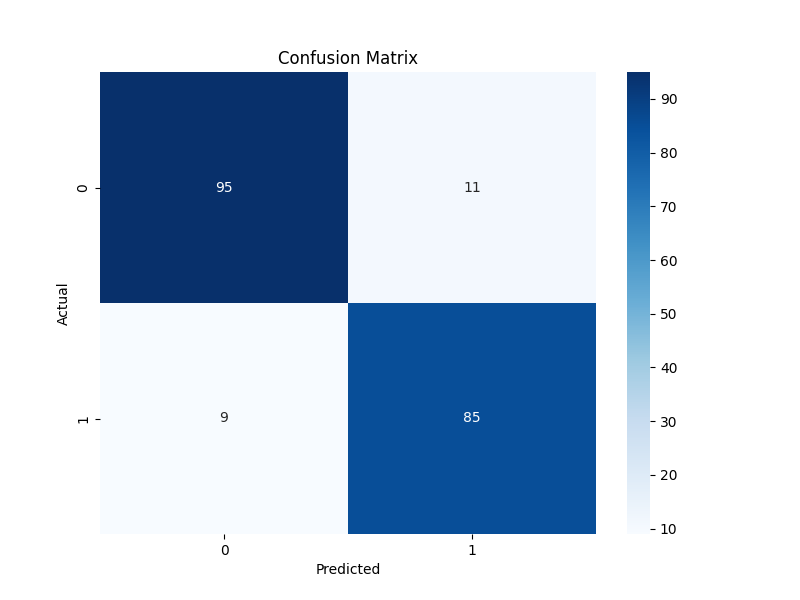
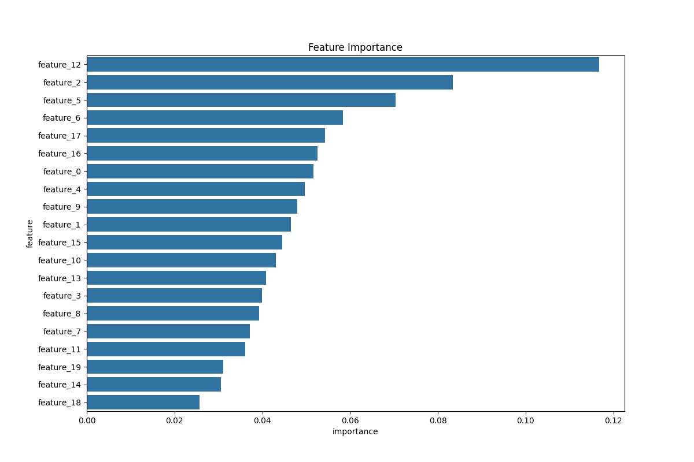

# MLOps PoC: Random Forest End-to-End Project

This project provides a full end-to-end Proof-of-Concept (PoC) for deploying a Random Forest classification model. It covers data generation, model training with experiment tracking using **MLflow**, and serving the model via a **FastAPI** REST API.

---

## 1. The Random Forest Algorithm

### 1.1. Conceptual Overview

Random Forest is an **ensemble learning** method used for both classification and regression tasks. It operates by constructing a multitude of decision trees at training time and outputting the class that is the mode of the classes (classification) or mean prediction (regression) of the individual trees.

Key concepts include:

- **Ensemble Method**: It combines multiple "weak learners" (decision trees) to create a single "strong learner." This approach, known as **bagging** (Bootstrap Aggregating), reduces variance and helps to avoid overfitting.
- **Bootstrap Sampling**: Each decision tree in the forest is trained on a different random subset of the training data, sampled with replacement. This means some data points may be used multiple times in a single tree's training set, while others may not be used at all.
- **Feature Randomness**: When splitting a node in a decision tree, the algorithm does not search for the best split among all features. Instead, it searches for the best split among a *random subset* of features. This introduces more diversity among the trees and further reduces variance.

### 1.2. Mathematical Formulation

The core of the Random Forest algorithm lies in the principles of **Gini Impurity** or **Entropy** to measure the quality of a split in a decision tree.

#### Gini Impurity

Gini Impurity is a measure of how often a randomly chosen element from the set would be incorrectly labeled if it was randomly labeled according to the distribution of labels in the subset. For a set with $C$ classes, the Gini Impurity is calculated as:

$$ Gini(p) = 1 - \sum_{i=1}^{C} (p_i)^2 $$

Where $p_i$ is the probability of an element being in class $i$. A Gini score of 0 represents a pure node (all elements belong to one class), while a score of 0.5 (for a binary case) represents maximum impurity.

#### Information Gain

The algorithm chooses the split that results in the highest **Information Gain**, which is the reduction in impurity after a dataset is split on an attribute. For a split that divides a parent node $P$ into $k$ child nodes $C_1, C_2, ..., C_k$, the Information Gain is:

$$ IG(P, split) = Gini(P) - \sum_{i=1}^{k} \frac{|C_i|}{|P|} Gini(C_i) $$

### 1.3. Industry Use Cases

- **Finance**: Credit scoring, fraud detection, and stock market prediction.
- **Healthcare**: Disease diagnosis, predicting patient risk, and identifying effective treatments.
- **E-commerce**: Customer segmentation, product recommendation, and churn prediction.
- **Manufacturing**: Predictive maintenance and quality control.

---

## 2. Project Structure

```
random_forest/
├── data/
│   └── generated_data.csv      # Synthetic data generated by the script
├── models/
│   └── random_forest_model.joblib # Trained and saved model for the API
├── plots/
│   ├── confusion_matrix.png      # Saved plot of the confusion matrix
│   └── feature_importance.png    # Saved plot of feature importances
├── utils/
│   └── io_utils.py             # Utility functions (e.g., for loading models)
├── .git/                       # Git directory
├── generate_data.py            # Script to generate synthetic data
├── train.py                    # Script to train the model and track with MLflow
├── serve_fastapi.py            # Script to serve the model via a FastAPI
├── requirements.txt            # Project dependencies
└── README.md                   # This file
```

---

## 3. Installation Guide

Follow these steps to set up the project environment.

1.  **Clone the Repository**
    ```bash
    git clone <your-repository-url>
    cd random_forest
    ```

2.  **Create a Virtual Environment**
    It is highly recommended to use a virtual environment to manage dependencies.
    ```bash
    # For Windows
    python -m venv venv
    venv\Scripts\activate

    # For macOS/Linux
    python3 -m venv venv
    source venv/bin/activate
    ```

3.  **Install Dependencies**
    Install all the required libraries from `requirements.txt`.
    ```bash
    pip install -r requirements.txt
    ```

---

## 4. Step-by-Step Usage

### Step 1: Generate the Dataset

Run the data generation script. This will create a synthetic dataset and save it in the `data/` directory.

```bash
python generate_data.py
```

### Step 2: Train the Model

Run the training script. This will train the Random Forest model, log all experiments to MLflow, and save the model and evaluation plots.

```bash
python train.py
```

### Step 3: Track Experiments with MLflow

MLflow is used to track and visualize the training process. To launch the MLflow UI, run the following command in your terminal:

```bash
mlflow ui
```

Navigate to `http://127.0.0.1:5000` in your web browser. You will find the "Random_Forest_PoC" experiment, where you can see the logged parameters, metrics, and artifacts (including the plots and the model itself).

### Step 4: Serve the Model with FastAPI

To start the API server, run the following command:

```bash
uvicorn serve_fastapi:app --reload
```

The API will be available at `http://127.0.0.1:8000`.

### Step 5: Make Predictions

You can send a POST request to the `/predict` endpoint to get predictions. Here is an example using `curl`:

```bash
curl -X POST "http://127.0.0.1:8000/predict" \
-H "Content-Type: application/json" \
-d '{
  "features": [
    [0.1, 0.2, 0.3, 0.4, 0.5, 0.6, 0.7, 0.8, 0.9, 1.0, 1.1, 1.2, 1.3, 1.4, 1.5, 1.6, 1.7, 1.8, 1.9, 2.0]
  ]
}'
```

---

## 5. Results and Evaluation

The training script automatically generates and saves the following plots, which are crucial for understanding model performance.

### Confusion Matrix

The confusion matrix helps visualize the performance of the classification model, showing the counts of true positive, true negative, false positive, and false negative predictions.

*(This image will be generated in `plots/confusion_matrix.png` after you run `train.py`)*



### Feature Importance

This plot shows which features the model found most important for making predictions. It helps in understanding the data and the model's decision-making process.

*(This image will be generated in `plots/feature_importance.png` after you run `train.py`)*

